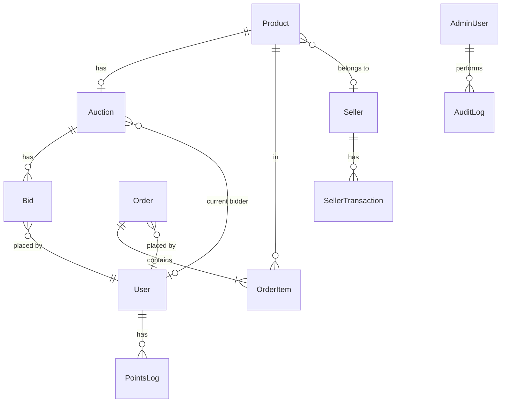

# Card ERP 資料庫 Schema 文檔

## 概述

Card ERP 使用 PostgreSQL 資料庫，透過 Prisma ORM 管理。Schema 定義位於 `services/api/prisma/schema.prisma`。

---

## ER 關聯圖

---

## 資料表說明

### Product（商品表）

| 欄位            | 型別           | 說明                              |
| --------------- | -------------- | --------------------------------- |
| id              | UUID           | 主鍵                              |
| type            | ProductType    | 商品類型（CARD / ACCESSORY）      |
| category        | String         | 分類（寶可夢、遊戲王等）          |
| name            | String         | 商品名稱                          |
| series          | String?        | 系列                              |
| cardNumber      | String?        | 卡號                              |
| gradingStatus   | GradingStatus? | 鑑定機構（RAW / PSA / ARS / BGS） |
| gradingScore    | Decimal(3,1)?  | 鑑定分數                          |
| costPrice       | Decimal(10,2)  | 成本價                            |
| sellingPrice    | Decimal(10,2)  | 售價                              |
| sellerId        | UUID?          | 賣家 ID（外鍵）                   |
| status          | ProductStatus  | 狀態（PENDING / LISTED / SOLD）   |
| channel         | ProductChannel | 通路（ONLINE / OFFLINE / BOTH）   |
| images          | JSONB          | 圖片陣列                          |
| video           | String?        | 影片連結                          |
| description     | Text           | 商品描述                          |
| conditionNotes  | Text?          | 品相備註                          |
| supplier        | String?        | 供應商                            |
| supplierContact | String?        | 供應商聯絡方式                    |
| stockQuantity   | Int            | 庫存數量（預設 1）                |
| createdAt       | DateTime       | 建立時間                          |
| updatedAt       | DateTime       | 更新時間                          |

### Auction（競標表）

| 欄位            | 型別           | 說明                                          |
| --------------- | -------------- | --------------------------------------------- |
| id              | UUID           | 主鍵                                          |
| productId       | UUID           | 商品 ID（唯一，一商品一競標）                 |
| startingPrice   | Decimal(10,2)  | 起標價                                        |
| buyNowPrice     | Decimal(10,2)? | 直購價                                        |
| currentPrice    | Decimal(10,2)  | 目前最高價                                    |
| incrementAmount | Decimal(10,2)  | 每次加價金額                                  |
| currentBidderId | UUID?          | 目前最高出價者                                |
| startTime       | DateTime       | 開始時間                                      |
| endTime         | DateTime       | 結束時間                                      |
| status          | AuctionStatus  | 狀態（UPCOMING / ACTIVE / ENDED / CANCELLED） |
| createdAt       | DateTime       | 建立時間                                      |

### Bid（出價記錄表）— Proxy Bidding

| 欄位      | 型別          | 說明                                            |
| --------- | ------------- | ----------------------------------------------- |
| id        | UUID          | 主鍵                                            |
| auctionId | UUID          | 競標 ID                                         |
| bidderId  | UUID          | 出價者 ID                                       |
| maxBid    | Decimal(10,2) | 用戶的最高出價上限（隱藏，僅出價者本人可見）    |
| amount    | Decimal(10,2) | 該次出價觸發後的顯示價（currentPrice 快照）     |
| isActive  | Boolean       | 是否為有效 proxy（被超越後設 false），預設 true |
| createdAt | DateTime      | 出價時間                                        |

### Order（訂單表）

| 欄位                 | 型別           | 說明                      |
| -------------------- | -------------- | ------------------------- |
| id                   | UUID           | 主鍵                      |
| orderNumber          | String         | 訂單編號（唯一）          |
| buyerId              | UUID?          | 買家 ID（POS 訂單可為空） |
| buyerName            | String?        | 買家姓名                  |
| buyerEmail           | String?        | 買家 Email                |
| buyerPhone           | String?        | 買家電話                  |
| subtotal             | Decimal(10,2)  | 小計                      |
| shippingFee          | Decimal(10,2)  | 運費                      |
| discountAmount       | Decimal(10,2)  | 折扣金額                  |
| finalAmount          | Decimal(10,2)  | 最終金額                  |
| paymentMethod        | PaymentMethod  | 付款方式                  |
| paymentStatus        | PaymentStatus  | 付款狀態                  |
| paymentTransactionId | String?        | 金流交易 ID               |
| paidAt               | DateTime?      | 付款時間                  |
| shippingMethod       | ShippingMethod | 配送方式                  |
| shippingAddress      | JSONB?         | 配送地址                  |
| trackingNumber       | String?        | 物流追蹤號                |
| shippedAt            | DateTime?      | 出貨時間                  |
| status               | OrderStatus    | 訂單狀態                  |
| channel              | OrderChannel   | 購買通路（ONLINE / POS）  |
| notes                | Text?          | 備註                      |
| createdAt            | DateTime       | 建立時間                  |
| updatedAt            | DateTime       | 更新時間                  |

### OrderItem（訂單項目表）

| 欄位         | 型別          | 說明             |
| ------------ | ------------- | ---------------- |
| id           | UUID          | 主鍵             |
| orderId      | UUID          | 訂單 ID          |
| productId    | UUID          | 商品 ID          |
| productName  | String        | 商品名稱（快照） |
| productPrice | Decimal(10,2) | 商品價格（快照） |
| sellerId     | String?       | 賣家 ID          |

### User（買家表）

| 欄位          | 型別          | 說明                              |
| ------------- | ------------- | --------------------------------- |
| id            | UUID          | 主鍵                              |
| email         | String        | Email（唯一）                     |
| name          | String        | 姓名                              |
| avatar        | String?       | 頭像                              |
| phone         | String?       | 電話                              |
| provider      | OAuthProvider | OAuth 供應商（GOOGLE / FACEBOOK） |
| providerId    | String        | OAuth 用戶 ID                     |
| loyaltyPoints | Int           | 紅利點數                          |
| memberLevel   | String        | 會員等級                          |
| createdAt     | DateTime      | 建立時間                          |
| updatedAt     | DateTime      | 更新時間                          |

### Seller（賣家表）

| 欄位              | 型別          | 說明                           |
| ----------------- | ------------- | ------------------------------ |
| id                | UUID          | 主鍵                           |
| email             | String        | Email（唯一）                  |
| name              | String        | 姓名                           |
| phone             | String?       | 電話                           |
| passwordHash      | String        | 密碼雜湊                       |
| level             | SellerLevel   | 等級（BRONZE / SILVER / GOLD） |
| totalSales        | Decimal(12,2) | 累計銷售額                     |
| commissionRate    | Decimal(5,2)  | 佣金比率                       |
| onlineListingFee  | Decimal(10,2) | 線上上架費                     |
| offlineListingFee | Decimal(10,2) | 線下上架費                     |
| balance           | Decimal(12,2) | 帳戶餘額                       |
| status            | SellerStatus  | 狀態（ACTIVE / SUSPENDED）     |
| createdAt         | DateTime      | 建立時間                       |
| updatedAt         | DateTime      | 更新時間                       |

### SellerTransaction（賣家交易記錄）

| 欄位        | 型別                  | 說明                                                 |
| ----------- | --------------------- | ---------------------------------------------------- |
| id          | UUID                  | 主鍵                                                 |
| sellerId    | UUID                  | 賣家 ID                                              |
| type        | SellerTransactionType | 類型（SALE / COMMISSION / LISTING_FEE / WITHDRAWAL） |
| amount      | Decimal(12,2)         | 金額（負數表示扣款）                                 |
| orderId     | String?               | 關聯訂單                                             |
| productId   | String?               | 關聯商品                                             |
| description | String?               | 說明                                                 |
| createdAt   | DateTime              | 建立時間                                             |

### AdminUser（管理員表）

| 欄位         | 型別        | 說明                                |
| ------------ | ----------- | ----------------------------------- |
| id           | UUID        | 主鍵                                |
| username     | String      | 帳號（唯一）                        |
| email        | String      | Email（唯一）                       |
| passwordHash | String      | 密碼雜湊                            |
| name         | String      | 姓名                                |
| role         | AdminRole   | 角色（SUPER_ADMIN / ADMIN / STAFF） |
| permissions  | JSONB       | 權限列表                            |
| status       | AdminStatus | 狀態（ACTIVE / INACTIVE）           |
| lastLoginAt  | DateTime?   | 最後登入時間                        |
| createdAt    | DateTime    | 建立時間                            |
| updatedAt    | DateTime    | 更新時間                            |

### AuditLog（操作記錄）

| 欄位       | 型別     | 說明                                |
| ---------- | -------- | ----------------------------------- |
| id         | UUID     | 主鍵                                |
| userId     | UUID?    | 操作者 ID                           |
| userType   | UserType | 操作者類型（ADMIN / SELLER）        |
| userName   | String?  | 操作者名稱                          |
| action     | String   | 操作（CREATE / UPDATE / DELETE 等） |
| entityType | String   | 實體類型（Product / Order 等）      |
| entityId   | String?  | 實體 ID                             |
| changes    | JSONB?   | 變更內容                            |
| ipAddress  | String?  | IP 位址                             |
| userAgent  | Text?    | 瀏覽器資訊                          |
| createdAt  | DateTime | 建立時間                            |

### PointsLog（紅利點數記錄）

| 欄位        | 型別          | 說明                                    |
| ----------- | ------------- | --------------------------------------- |
| id          | UUID          | 主鍵                                    |
| userId      | UUID          | 用戶 ID                                 |
| amount      | Int           | 點數變動量（負數表示扣除）              |
| type        | PointsLogType | 類型（EARN / REDEEM / REFUND / EXPIRE） |
| orderId     | String?       | 關聯訂單                                |
| description | String?       | 說明                                    |
| createdAt   | DateTime      | 建立時間                                |

---

## 索引策略

| 資料表              | 索引欄位                      | 用途         |
| ------------------- | ----------------------------- | ------------ |
| products            | (status, channel)             | 商品列表篩選 |
| products            | (sellerId)                    | 賣家商品查詢 |
| products            | (category)                    | 分類篩選     |
| products            | (createdAt)                   | 時間排序     |
| auctions            | (productId) UNIQUE            | 一商品一競標 |
| auctions            | (status, endTime)             | 競標列表篩選 |
| bids                | (auctionId)                   | 競標出價查詢 |
| bids                | (bidderId)                    | 用戶出價記錄 |
| orders              | (orderNumber) UNIQUE          | 訂單編號查詢 |
| orders              | (buyerId)                     | 買家訂單查詢 |
| orders              | (status)                      | 訂單狀態篩選 |
| orders              | (createdAt)                   | 時間排序     |
| order_items         | (orderId)                     | 訂單項目查詢 |
| users               | (email) UNIQUE                | Email 登入   |
| users               | (provider, providerId) UNIQUE | OAuth 登入   |
| sellers             | (email) UNIQUE                | Email 登入   |
| sellers             | (level)                       | 等級篩選     |
| seller_transactions | (sellerId)                    | 賣家交易查詢 |
| seller_transactions | (type)                        | 交易類型篩選 |
| admin_users         | (username) UNIQUE             | 帳號登入     |
| admin_users         | (email) UNIQUE                | Email 登入   |
| audit_logs          | (userType, userId)            | 操作者查詢   |
| audit_logs          | (entityType, entityId)        | 實體操作記錄 |
| audit_logs          | (createdAt)                   | 時間排序     |
| points_log          | (userId)                      | 用戶點數記錄 |

---

## 關聯關係

| 關聯                       | 類型           | onDelete |
| -------------------------- | -------------- | -------- |
| Product → Seller           | 多對一（可選） | SET NULL |
| Auction → Product          | 一對一         | CASCADE  |
| Auction → User (bidder)    | 多對一（可選） | SET NULL |
| Bid → Auction              | 多對一         | CASCADE  |
| Bid → User                 | 多對一         | RESTRICT |
| Order → User               | 多對一（可選） | SET NULL |
| OrderItem → Order          | 多對一         | CASCADE  |
| OrderItem → Product        | 多對一         | RESTRICT |
| SellerTransaction → Seller | 多對一         | RESTRICT |
| AuditLog → AdminUser       | 多對一（可選） | SET NULL |
| PointsLog → User           | 多對一         | RESTRICT |

---

## Enum 列表

| Enum                  | 值                                                 |
| --------------------- | -------------------------------------------------- |
| ProductType           | CARD, ACCESSORY                                    |
| ProductStatus         | PENDING, LISTED, SOLD                              |
| ProductChannel        | ONLINE, OFFLINE, BOTH                              |
| GradingStatus         | RAW, PSA, ARS, BGS                                 |
| AuctionStatus         | UPCOMING, ACTIVE, ENDED, CANCELLED                 |
| PaymentMethod         | CASH, CREDIT_CARD, LINE_PAY, TRANSFER              |
| PaymentStatus         | PENDING, PAID, FAILED, REFUNDED                    |
| ShippingMethod        | SEVEN_ELEVEN, FAMILY_MART, FACE_TO_FACE, IN_STORE  |
| OrderStatus           | PENDING, PROCESSING, SHIPPED, COMPLETED, CANCELLED |
| OrderChannel          | ONLINE, POS                                        |
| OAuthProvider         | GOOGLE, FACEBOOK                                   |
| SellerLevel           | BRONZE, SILVER, GOLD                               |
| SellerStatus          | ACTIVE, SUSPENDED                                  |
| SellerTransactionType | SALE, COMMISSION, LISTING_FEE, WITHDRAWAL          |
| AdminRole             | SUPER_ADMIN, ADMIN, STAFF                          |
| AdminStatus           | ACTIVE, INACTIVE                                   |
| UserType              | ADMIN, SELLER                                      |
| PointsLogType         | EARN, REDEEM, REFUND, EXPIRE                       |
